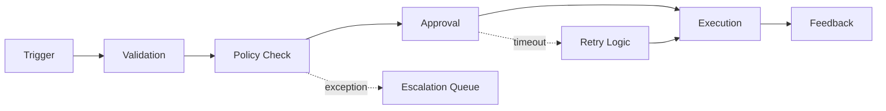
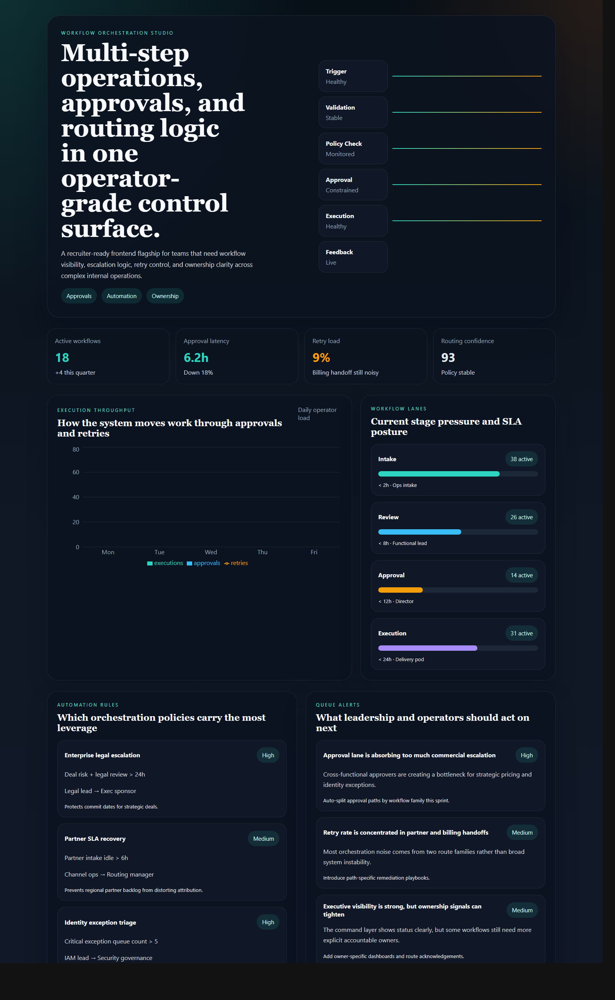
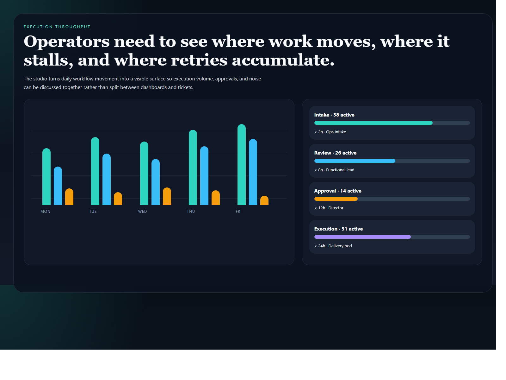
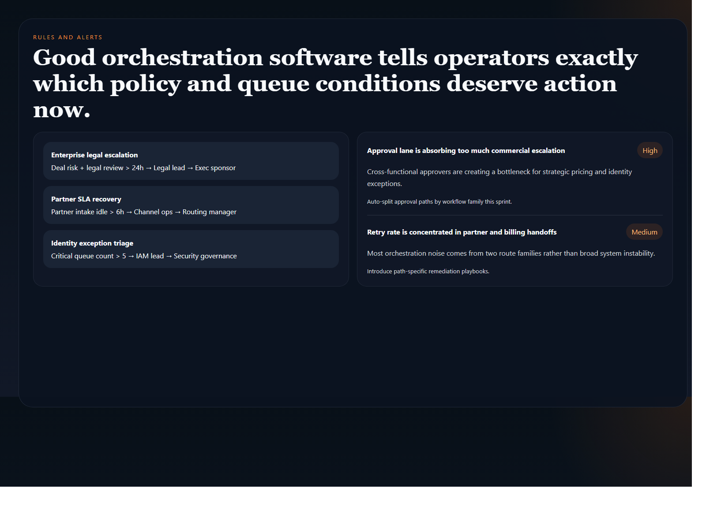
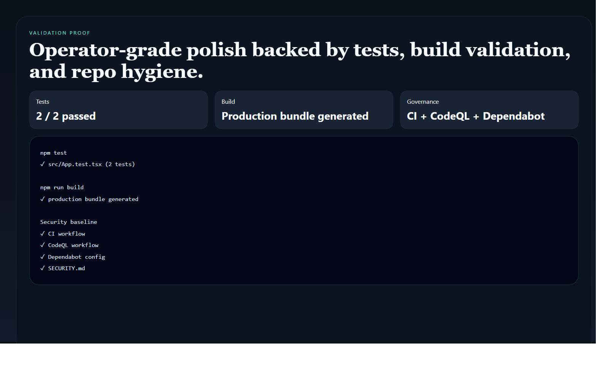

# Workflow Orchestration Studio

> **React + TypeScript portfolio project** demonstrating workflow routing, approval logic, retry visibility, SLA-aware operations, and operator-grade frontend systems design.

**Recruiter takeaway:** *"This person can make internal workflows feel like a real operating product, not a glorified process chart."*

---

## Project Overview

| Attribute | Detail |
|---|---|
| **Frontend Stack** | React 19 + Vite + TypeScript |
| **Domain** | Workflow orchestration, approvals, routing, retries |
| **Audience** | Operations leadership, RevOps, platform teams, internal tool stakeholders |
| **Signal Areas** | Throughput · approvals · retries · SLA pressure · ownership |
| **Portfolio Role** | Frontend flagship for workflow and operations control-plane design |
| **Validation** | Vitest + Testing Library |

---

## Executive Summary

Workflow Orchestration Studio is a recruiter-ready frontend project built to feel like a premium internal command surface for multi-step operations. Instead of burying routing logic inside tickets and runbooks, it presents workflow pressure, escalation points, automation rules, and retry behavior in one operator-facing interface.

It is designed to show that orchestration can be productized with the same seriousness as revenue and executive tooling.

---

## Business Problem

Complex internal operations often rely on fragmented ownership, ambiguous approval paths, and manual escalation habits. Teams need a workspace that reveals where workflows stall, where retries concentrate, which policies drive leverage, and what action is needed now.

---

## Solution

This studio turns orchestration into a coordinated frontend surface for:

- approval and routing visibility
- execution throughput analysis
- retry and SLA pressure tracking
- automation-rule prioritization
- operator-grade workflow UX

---

## Architecture

```text
Workflow datasets and routing signals
    |
    v
Static TypeScript data model
    |
    v
React orchestration shell
    |
    +--> signal cards
    +--> throughput views
    +--> lane pressure views
    +--> automation rules
    +--> queue alert layer
```

### Workflow Map



### Workspace Flow

1. Operators land on one surface that shows throughput, latency, and retry posture.
2. Workflow lanes expose which stages are absorbing the most pressure.
3. Automation rules show which orchestration paths matter most.
4. Queue alerts reveal where leadership and operators should intervene next.
5. The workflow map explains how the system behaves across approval and exception paths.

---

## Screenshots

### Hero Capture



### Coverage and Throughput View



### Rules and Alert View



### Validation Proof



---

## Key Design Decisions

| Decision | Rationale |
|---|---|
| **Operator-first framing** | Makes the repo feel like live workflow software, not an abstract governance page |
| **Routing + retry emphasis** | Highlights the operational complexity real internal systems carry |
| **Mermaid flow documentation** | Keeps approval and exception logic legible in GitHub itself |
| **Distinct orchestration palette** | Gives the project a separate visual identity from executive and revenue dashboards |
| **Policy and queue focus** | Grounds the design in ownership and next-step action rather than passive visibility |

---

## What An Engineering Leader Sees Here

- frontend systems design grounded in real internal workflow complexity
- clear translation of routing and approval logic into product structure
- strong visual hierarchy for operator-facing decision surfaces
- portfolio breadth across workflows, revenue, governance, security, and executive tooling

---

## Getting Started

### Prerequisites

- Node.js 20+
- npm

### Setup

```bash
git clone https://github.com/mizcausevic-dev/workflow-orchestration-studio.git
cd workflow-orchestration-studio
npm install
cp .env.example .env
npm run dev
```

Open:

- `http://localhost:5173`

### Run Tests

```bash
npm test
```

### Build

```bash
npm run build
```

---

## What This Demonstrates

- premium frontend execution for internal workflow systems
- approvals and orchestration translated into product logic
- Mermaid-backed documentation for process/state communication
- React + TypeScript implementation with tests and production-minded repo hygiene
- product thinking that works at the operator layer, not just the executive layer

---

## Future Enhancements

- workflow family filters
- owner-level capacity views
- drag-and-drop path simulation
- state-specific SLA drilldowns
- API-backed automation history and rollback flows

---

## Tech Stack

[](https://react.dev/)
[](https://vite.dev/)
[](https://www.typescriptlang.org/)
[](https://recharts.org/)
[](https://mermaid.js.org/)
[](https://vitest.dev/)
[](https://opensource.org/license/mit)

### Portfolio Links

- [LinkedIn](https://www.linkedin.com/in/mirzacausevic)
- [Skills Page](https://mizcausevic.com/skills/)
- [Medium](https://medium.com/@mizcausevic)
- [GitHub](https://github.com/mizcausevic-dev)

---

*Part of [mizcausevic-dev's GitHub portfolio](https://github.com/mizcausevic-dev) — demonstrating workflow systems thinking, operator-grade product design, and orchestration logic made visible.*
