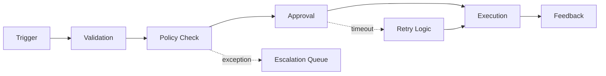

# Workflow Orchestration Studio Architecture

## Service Overview

Workflow Orchestration Studio is a frontend portfolio project designed to present approvals, routing, retries, and ownership workflows as an operator-grade command surface instead of a static process diagram.

## Request Flow

1. Static TypeScript datasets model workflow lanes, throughput, automation rules, escalation alerts, and orchestration steps.
2. The React application translates those datasets into a command-layer UI with charting, routing logic views, and ownership signals.
3. Recharts visualizations provide concise visibility into execution throughput, approval load, and retry pressure.

## Interface Map

- `Hero`
  - positions the workspace as a control surface for internal operations
- `Signal cards`
  - summarize workflow volume, latency, retries, and confidence
- `Throughput chart`
  - compares executions, approvals, and retries over time
- `Workflow lanes`
  - shows stage pressure and SLA posture
- `Automation rules`
  - surfaces the highest-leverage orchestration policies
- `Queue alerts`
  - highlights what operators should act on next

## Mermaid Flow

## Design Notes

- The visual language leans warmer and more operational than the executive dashboards so the project feels like a live workflow system.
- The orchestration map is intentionally human-readable before it becomes technically dense.
- The README uses Mermaid directly because workflow logic benefits from state and path visibility.

## Future Upgrades

- filterable workflow families
- ownership drilldowns by team
- live reroute simulations
- retry analytics with confidence bands
